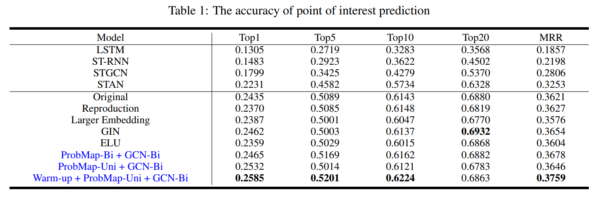

# Community detection and POI prediction based on geographical locations

This work focus on design a model to predict/recommend new POIs for users based on their historical POIs.

I follow previous work https://arxiv.org/abs/2303.04741 (codes in https://github.com/songyangme/GETNext) for model architecture. 

The contribution is to boost the training by AdamW optimizer and using uni-directional trajectory flow map to smooth the GCN (in the sense of information propagation).

With these technique, we can improve the previous model by 1-2% accuracy (as shown in the below figure).

## timeline

